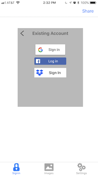
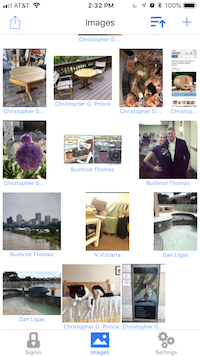
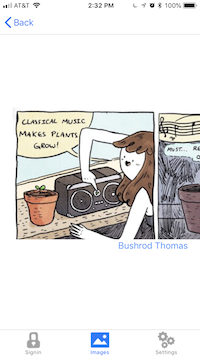
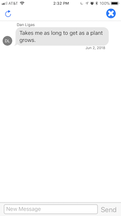
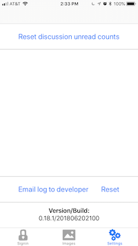

# SharedImages

## Screen grabs

<kbd>
  
</kbd>

   

## Features

### Privately shared images

Users can store their images in their own cloud storage, and safely share those images with others

### Private discussion threads per image

Conversations about the images are also stored in user cloud storage. And the same (sharing and owning) users that can access the images can access the discussion threads.
    
### Google Drive and Dropbox for cloud storage

These are for owning users.

### Sharing users: Facebook and Google

## Development status

Eventually, SharedImages will be on the Apple app store. The backend ([SyncServerII](https://github.com/crspybits/SyncServerII/)) isn't quite ready for public distribution though. If you want an early look at this app, please contact the developer (chris@SpasticMuffin.biz) for TestFlight access.

If you want to go it alone, and boot up your own [SyncServerII](https://github.com/crspybits/SyncServerII/) instance, you can do that yourself too. [See the instructions here for that](https://crspybits.github.io/SyncServerII/).

## Building this project

[Straight out of the box, this project will not build cleanly. See these instructions.](https://crspybits.github.io/SyncServerII/#SHAREDIMAGES)
